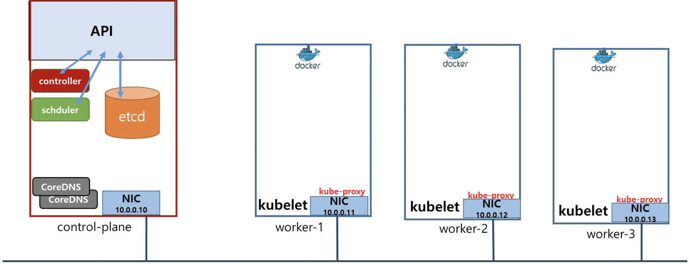
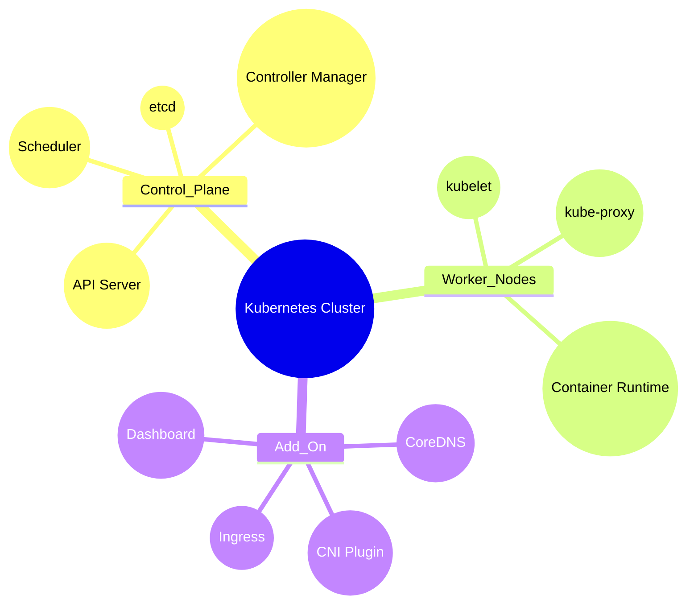

# 쿠버네티스 아키텍처 정리

## 전체적인 흐름

1. **API Server**를 중심으로 모든 통신이 이뤄집니다.
2. 클러스터 상태는 **etcd**라는 분산 저장소에 기록됩니다.
3. **Controller Manager**와 **Scheduler**는 API Server를 통해 ‘현재 상태’를 확인하고, ‘원하는 상태’가 되도록 작업을 지시합니다.
4. 각 노드의 **kubelet**은 API Server로부터 “Pod를 띄워라, 없애라” 같은 요청을 받아, 실제로 컨테이너를 실행·관리합니다.
5. **kube-proxy**는 서비스 트래픽(가상 IP로 들어오는 요청)을 적절한 Pod로 연결해 줍니다.
6. **CoreDNS**는 클러스터 안에서 서비스 이름을 DNS로 찾아갈 수 있도록 도와줍니다.

---

## Control Plane 컴포넌트 (클러스터 뇌 역할)

### 1. API Server
- 쿠버네티스의 ‘**입구**’
- 다른 모든 컴포넌트가 API Server에 요청을 보내서 클러스터 상태를 보고, 수정합니다.

### 2. etcd
- 클러스터 전체 상태(어떤 Pod가 어디서 돌아가는지, Config, 시크릿 등)를 저장하는 ‘**메모리**’
- API Server만 직접 접근해 읽고 쓰기 때문에, 모든 상태가 일관성 있게 유지됩니다.

### 3. Controller Manager
- 여러 ‘**컨트롤러**’의 모음입니다.
  - 예: ReplicaSet Controller(“Pod 개수를 일정하게 유지”), Node Controller(“노드 상태 확인”) 등.
- 클러스터 상태를 보고 “Pod가 부족하면 새로 만들자”처럼 조정합니다.

### 4. Scheduler
- “어떤 Pod가 어떤 노드에서 실행될까?”를 결정하는 ‘**스케줄러**’
- 노드 자원 사용량, 라벨 등 여러 조건을 보고 최적의 노드를 골라 API Server에 알려줍니다.

---

## Worker Node 컴포넌트 (실제로 일하는 일꾼)

### 1. kubelet
- 각 노드에서 실행되는 ‘**노드 에이전트**’
- API Server의 명령에 따라 실제 컨테이너를 실행하거나 종료합니다.
- “Pod가 잘 돌아가고 있는지” 상태 정보를 계속 API Server에 보고합니다.

### 2. kube-proxy
- 서비스(가상 IP)로 들어오는 트래픽을 적절한 Pod로 라우팅해주는 ‘**프록시**’
- 예를 들어, `Service IP`로 들어오면 노드나 Pod IP로 연결해줍니다(iptables/IPVS 등 이용).

### 3. 컨테이너 런타임 (Docker, containerd 등)
- kubelet이 “Pod를 실행해!”라고 명령하면, 실제로 컨테이너를 만들고 관리하는 역할입니다.

---

## Add-On 컴포넌트 (추가 기능)

### 1. CoreDNS
- 클러스터 안에서 `서비스이름.namespace.svc.cluster.local`처럼 DNS 이름으로 통신할 수 있게 해주는 ‘**DNS 서버**’입니다.
- kube-proxy가 만들어둔 서비스 IP와 연동되어, 서비스 이름만 알아도 자동으로 해당 Pod로 연결이 가능합니다.

### 2. CNI 플러그인 (Calico, Flannel 등)
- “Pod가 어떤 IP를 받을지”, “Pod 간 통신은 어떻게 할지”를 담당하는 ‘**네트워크 플러그인**’
- kubelet이 Pod를 만들 때, CNI 플러그인을 통해 IP 할당, 네트워크 연결 등을 설정합니다.

### 3. Ingress
- HTTP/HTTPS 트래픽을 어떤 서비스로 보낼지 결정해주는 ‘**7계층 라우터**’ 역할.
- 예: `myapp.example.com`으로 들어온 요청을 특정 서비스로 보낸다.

### 4. Dashboard
- 웹 UI 형태로 클러스터 리소스(노드, Pod, 서비스 등)를 관리·모니터링할 수 있게 해주는 ‘**관리도구**’.

---

##  컴포넌트 정리

- **Control Plane(중앙 뇌)**: API Server, etcd, Controller Manager, Scheduler
- **Worker Node(일꾼)**: kubelet, kube-proxy, 컨테이너 런타임
- **Add-On**: CoreDNS, CNI 플러그인, Ingress, Dashboard 등 필요한 기능을 추가로 설치

